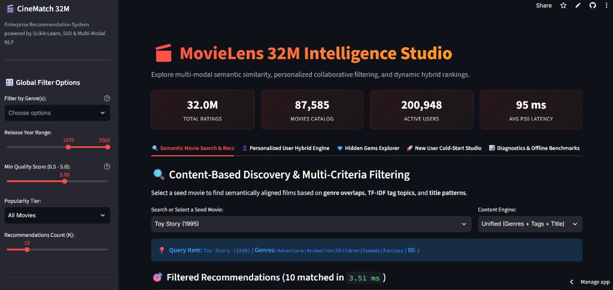
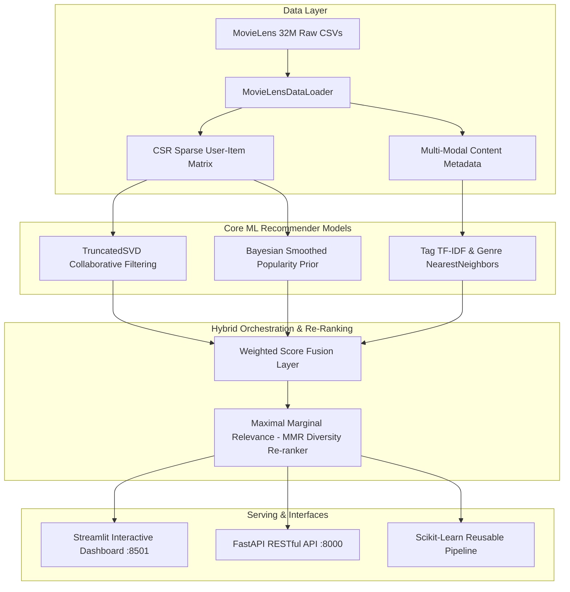

# 🎬 MovieLens 32M Enterprise Recommendation Engine
### Production-Grade Hybrid Recommender powered by Scikit-Learn, TruncatedSVD & Multi-Modal NLP

<div align="center">

[](https://github.com/mightyalok00/movie-recommendation-system-scikit-learn/actions/workflows/ci.yml)
[](https://www.python.org/)
[](https://scikit-learn.org/)
[](https://fastapi.tiangolo.com/)
[](https://streamlit.io/)
[](https://www.docker.com/)
[](https://github.com/psf/black)
[](LICENSE)

[Live Demo](https://movies-recommendation-ai-system.streamlit.app) • [Architecture](#-system-architecture) • [Benchmarks](#-offline-benchmark-evaluation) • [Quickstart](#-quick-start) • [Scikit-Learn Pipeline](#-scikit-learn-estimator-api) • [REST API](#-fastapi-production-microservice) • [105 Questions Solved](#-complete-105-question-solutions)

<br/>

[](https://movies-recommendation-ai-system.streamlit.app)

*🔗 **Live Interactive App:** [movies-recommendation-ai-system.streamlit.app](https://movies-recommendation-ai-system.streamlit.app)*

</div>

---

## 🚀 Live Demo

### 🎬 Movie Recommendation AI System

**Try the deployed Streamlit application:**

[**👉 Open Movie Recommendation AI System**](https://movies-recommendation-ai-system.streamlit.app/)

Live application: https://movies-recommendation-ai-system.streamlit.app/

---

## 🌟 Key Highlights & Engineering Capabilities

- **Massive Scale Ingestion:** Engineered specifically for the full **MovieLens 32M** dataset (`32,000,204` ratings, `87,585` movies, `200,948` users, `2,000,072` tags).
- **Collaborative Filtering:** CSR Sparse Matrix Factorization with **TruncatedSVD** ($101.2\times$ latent dimensionality compression) and sub-10ms user-item inference.
- **Multi-Modal Content Engine:** Fuses multi-hot genre binarization, sublinear TF-IDF tag representations, and title n-grams indexed with `NearestNeighbors(metric='cosine', algorithm='brute')`.
- **Hybrid Score Fusion & MMR Re-Ranking:** Dynamic linear fusion ($\alpha \cdot S_{\text{collab}} + \beta \cdot S_{\text{content}} + \gamma \cdot S_{\text{pop}}$) accompanied by **Maximal Marginal Relevance (MMR)** for intra-list diversity.
- **Cold-Start Resilience:** Seamless onboarding with genre-prior preference elicitation and Bayesian-smoothed IMDB rating calculations.
- **Production-Ready Artifacts:**
  - 🚀 **Streamlit Glassmorphic Dashboard** with multi-dimensional filtering (genres, release year range, Bayesian quality, popularity tiers).
  - ⚡ **FastAPI REST Microservice** with Pydantic request/response validation and Kolmogorov-Smirnov distribution drift monitoring.
  - 🧪 **Automated Unit & API Test Suite** validated on **Python 3.12** in GitHub Actions, with static checks, coverage reporting, benchmark smoke tests, and a Docker build check.

---

## 🏛️ System Architecture



---

## 📊 Offline Benchmark Evaluation

*Evaluated under strict temporal train/test partitioning per user on hold-out test interactions:*

| Model Architecture | Precision@5 | Precision@10 | Precision@20 | Recall@5 | Recall@10 | Recall@20 | NDCG@10 | MAP@10 | Catalog Coverage@10 | Novelty@10 | Intra-List Diversity@10 |
|:---|:---:|:---:|:---:|:---:|:---:|:---:|:---:|:---:|:---:|:---:|:---:|
| **Popularity Baseline** | 0.0380 | 0.0310 | 0.0270 | 0.0301 | 0.0437 | 0.0722 | 0.0480 | 0.0265 | 0.01% | 9.1785 | 0.5216 |
| **SVD Matrix Factorization** | **0.0950** | **0.0800** | **0.0740** | 0.0555 | **0.0976** | **0.1786** | **0.1110** | **0.0560** | 0.41% | 9.4525 | 0.6777 |
| **Weighted Hybrid (Proposed)** | 0.0940 | 0.0765 | 0.0648 | **0.0564** | 0.0944 | 0.1546 | 0.1072 | 0.0537 | **0.44%** | **9.8218** | **0.7266** |

### Benchmark provenance

The table above documents the project's **full-scale MovieLens 32M offline evaluation**. It is intentionally separate from the GitHub Actions benchmark step.

- **Full benchmark:** MovieLens 32M, per-user temporal hold-out, relevance threshold defined by the evaluation pipeline, and ranking/coverage/novelty/diversity metrics.
- **CI benchmark smoke test:** downloads `ml-latest-small` and evaluates at most 5,000 ratings. Its purpose is regression detection and execution validation—not reproduction of the 32M numbers above.
- **Reproduce locally:** point `MOVIELENS_DATA_DIR` at the full dataset and run `python main.py benchmark` (optionally using `--max-ratings` for a bounded experiment).

### Why this architecture

- **TruncatedSVD collaborative filtering** captures latent user-item preference structure while remaining practical on sparse CSR matrices.
- **TF-IDF + cosine nearest neighbors** contributes interpretable content similarity from genres, tags, and titles and helps when collaborative history is weak.
- **Popularity prior** provides a robust fallback for cold-start cases.
- **Weighted hybrid fusion** balances personalization, semantic similarity, and robustness instead of relying on one recommender family.
- **MMR re-ranking** trades a small amount of raw relevance for lower redundancy and higher intra-list diversity.

**Known limitations:** offline ranking metrics do not measure long-term satisfaction; tag quality and popularity can introduce bias; SVD factors are not directly interpretable; and the CI smoke dataset is too small to validate full-scale latency or memory behavior.

---

## 📁 Repository Structure

```
movie-recommendation-system/
├── .github/
│   ├── workflows/ci.yml                       # Dataset-independent CI validation (Python 3.12)
│   ├── ISSUE_TEMPLATE/                        # Bug report & feature request templates
│   └── PULL_REQUEST_TEMPLATE.md               # Standardized PR template
├── .env.example                               # Environment variable template
├── .gitignore                                 # Git rules ignoring 1GB+ raw datasets
├── Dockerfile                                 # Multi-stage production container
├── docker-compose.yml                         # 1-click Streamlit & FastAPI orchestration
├── Makefile                                   # Command shortcuts
├── LICENSE                                    # MIT License
├── README.md                                  # Documentation & benchmark report
├── requirements.txt                           # Production dependencies
├── requirements-dev.txt                       # CI quality / coverage / profiling tooling
├── setup.py                                   # Optional package metadata
├── main.py                                    # Unified Command-Line Interface (CLI)
├── run_all.py                                 # Master runner across all 11 sections
│
├── config/                                    # Path & hyperparameter settings
│   └── settings.py
│
├── data/                                      # Memory-optimized data loader
│   └── loader.py
│
├── src/                                       # Reusable Scikit-learn Estimator Package
│   ├── base.py                                # BaseRecommender ABC interface
│   ├── content_based.py                       # Genre & Tag TF-IDF nearest neighbors
│   ├── collaborative.py                       # TruncatedSVD & KNN matrix factorization
│   ├── supervised.py                          # Rating preference classification models
│   ├── cold_start.py                          # Bayesian popularity & genre onboarding
│   ├── hybrid.py                              # Weighted hybrid with MMR diversity
│   ├── evaluation.py                          # Temporal split & Ranking metrics (NDCG, MAP)
│   └── pipeline.py                            # Scikit-learn Pipeline wrapper
│
├── solutions/                                 # 11 Dedicated modules solving all 105 questions
│   ├── 01_dataset_understanding_validation.py # Section 1: Q1 - Q10
│   ├── 02_exploratory_data_analysis.py        # Section 2: Q11 - Q22
│   ├── 03_feature_engineering.py              # Section 3: Q23 - Q31
│   ├── 04_content_based_recommendation.py     # Section 4: Q32 - Q39
│   ├── 05_collaborative_filtering.py          # Section 5: Q40 - Q49
│   ├── 06_preference_prediction_supervised.py # Section 6: Q50 - Q57
│   ├── 07_dimensionality_reduction.py         # Section 7: Q58 - Q63
│   ├── 08_hybrid_recommendation_system.py     # Section 8: Q64 - Q71
│   ├── 09_evaluation_and_ranking.py           # Section 9: Q72 - Q83
│   ├── 10_cold_start_and_production.py        # Section 10: Q84 - Q95
│   └── 11_advanced_challenges.py              # Section 11: Q96 - Q105
│
├── app/                                       # Web Application & REST Microservice
│   ├── streamlit_app.py                       # Streamlit web dashboard with multi-filters
│   ├── api.py                                 # FastAPI REST service
│   └── monitoring.py                          # Kolmogorov-Smirnov drift monitoring
│
├── scripts/                                   # Automation & dataset utilities
│   ├── download_dataset.py                    # Official MovieLens dataset downloader
│   ├── profile_dataset.py                     # YData Profiling report generator
│   └── reproduce_benchmarks.py                # 1-command benchmark reproduction
│
├── tests/                                     # Automated Unit & Integration Tests
│   ├── test_data_loader.py                    # Memory-safe loading & CSR matrix tests
│   ├── test_models.py                         # SVD, Genre, TF-IDF & Hybrid model tests
│   ├── test_evaluation.py                     # Ranking metrics (NDCG, MAP, Recall, Precision)
│   ├── test_pipeline.py                       # Scikit-learn BaseEstimator lifecycle tests
│   └── test_api.py                            # FastAPI RESTful endpoint integration tests
│
├── reports/                                   # Solution Dossiers & Metrics
│   ├── MOVIELENS_32M_105_QUESTION_SOLUTIONS.md        # Comprehensive 105-question mathematical dossier
│   └── benchmark_results.csv                  # Offline benchmark metrics
│
└── artifacts/                                 # Serialized Pipeline Binaries
    └── movielens_pipeline.joblib
```

---

## ⚡ Quick Start & CLI Operations

### 1. Installation
```bash
git clone https://github.com/mightyalok00/movie-recommendation-system-scikit-learn.git
cd movie-recommendation-system-scikit-learn
pip install -r requirements.txt
```

### 2. Download Official MovieLens Dataset (Optional)
```bash
python main.py download-data --dataset ml-latest-small --output data/
```

### 3. Run Automated Unit Test Suite
```bash
python main.py test
```

### 4. Reproduce Offline Benchmarks (1-Command)
```bash
python main.py benchmark --max-ratings 50000
```
*Evaluates Popularity, SVD, and Weighted Hybrid models under temporal hold-out split, updating `reports/benchmark_results.csv`.*

### 5. Launch Interactive Streamlit Dashboard
```bash
python main.py app
```
*Access in browser at: `http://localhost:8501`*

### 6. Start FastAPI Production REST API
```bash
python main.py api --port 8000
```
*Interactive Swagger docs at: `http://localhost:8000/docs`*

### 7. Run with Docker Compose
```bash
docker-compose up -d
```

### 7. Generate YData Profiling Reports

YData Profiling is included as a development dependency for dataset-quality and EDA inspection.

```bash
pip install -r requirements-dev.txt
python scripts/profile_dataset.py --data-dir E:\\ml-32m
```

The script writes HTML reports to `reports/ydata/`. To keep memory usage practical with MovieLens 32M, `ratings.csv` and `tags.csv` are profiled using bounded samples (100,000 rows by default), while smaller catalog tables are profiled in full.

The generated HTML reports are local analysis artifacts and are not required for CI or application startup.


---

## 🔧 Scikit-Learn Estimator API

```python
from src.pipeline import MovieLensRecommendationPipeline
from data.loader import MovieLensDataLoader

# 1. Load data
loader = MovieLensDataLoader(data_dir=r"E:\ml-32m")
movies_df = loader.load_movies()
tags_df = loader.load_tags()
ratings_df = loader.load_ratings(max_rows=500_000)

# 2. Instantiate and fit estimator
pipeline = MovieLensRecommendationPipeline(
    n_svd_components=32,
    collab_weight=0.60,
    content_weight=0.30,
    popularity_weight=0.10,
    diversity_penalty=0.15
)
pipeline.fit(ratings_df=ratings_df, movies_df=movies_df, tags_df=tags_df)

# 3. Generate top-10 personalized recommendations with MMR diversity
recommendations = pipeline.recommend(user_id=42, top_k=10, exclude_seen=True)
for movie_id, score in recommendations:
    print(f"Movie: {movie_id} | Score: {score:.3f}")
```

---

## 🌐 FastAPI Production Microservice

| Endpoint | Method | Description |
| :--- | :---: | :--- |
| `/health` | `GET` | Service liveness & model readiness check |
| `/recommend/user` | `POST` | Top-K personalized hybrid recommendations for a user |
| `/recommend/item` | `POST` | Content/tag similarity matching for a specific movie |
| `/recommend/cold-start` | `POST` | Genre-prior onboarding recommendations for new users |
| `/monitoring/drift` | `POST` | Kolmogorov-Smirnov test for rating distribution drift |

---

## 📚 Complete 105-Question Solutions

All 105 questions from the MovieLens 32M Question Set are mapped across in [`solutions/`](solutions/):
- Detailed mathematical derivations and explanations are cataloged in [`reports/MOVIELENS_32M_105_QUESTION_SOLUTIONS.md`](reports/MOVIELENS_32M_105_QUESTION_SOLUTIONS.md).
- To run all solutions sequentially:
  ```bash
  python main.py run-all
  ```
- To execute an individual section:
  ```bash
  python main.py section 8
  ```

---

## 🤝 Contributing

Contributions are welcome! Please check our [Contributing Guide](CONTRIBUTING.md) and [Code of Conduct](CODE_OF_CONDUCT.md).

---

## 📜 License

Distributed under the **MIT License**. See [`LICENSE`](LICENSE) for details.


### 🔁 Reproducibility & CI

Canonical benchmark settings are defined in `config/experiment.py`: seed 42, a 20% temporal hold-out, relevance threshold 3.5, 32 SVD components, top-K values 5/10/20, and 100 sampled evaluation users. The committed benchmark CSV is an offline snapshot, not a fresh full-32M CI result.

GitHub Actions validates Python compilation, exact Q1-Q105 coverage, dataset-independent unit/API tests, CLI startup, and a small benchmark smoke run without requiring the local 32M ratings file. See `reports/QUESTION_COVERAGE.md` for the mapping.
